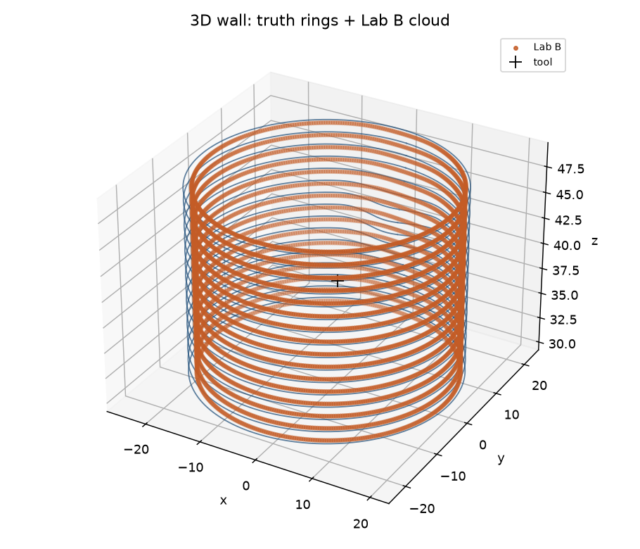

# SonoLab

**Echoes → 3D pipe wall** under unknown tool pose, fluid sound speed, and defect map.

Open research / portfolio work on **in-pipe ultrasonic geometry**: physics engines (FDTD / SPECFEM) are the **referee**; the **product surface** is a blind estimator that only sees instrument TX/RX (plus an explicit labeled fluid calibration when you want absolute scale).



**[Live site](https://althaafsn.github.io/sonolab/)** · **[Open the interactive 3D demo](https://althaafsn.github.io/sonolab/demo/block8/survey3d_view.html)** · [Unwrapped \(R(\theta,z)\) map](docs/demo/block8/survey3d_Rmap.png) · [Orbit clip](docs/demo/block8/orbit.mp4)

---

## Quickstart (Block 8 cloud)

Needs Python ≥3.10. SPECFEM is **optional** for this path.

```bash
git clone https://github.com/althaafsn/sonolab.git
cd sonolab
python -m venv .venv && source .venv/bin/activate
pip install -e ".[dev]"

# Smoke demo (minutes): 15° × 6 z acquire → display mesh
sonolab block8-demo --c-cal 0.45 --fast --out datasets/runs/_block8_demo_smoke
```

Open `datasets/runs/_block8_demo_smoke/survey3d_view.html` (or the checked-in [docs/demo/block8](docs/demo/block8/) viewer).

Full acquire (1° × 16 z, parallel Lab A; tens of minutes on a laptop):

```bash
sonolab block8-demo --c-cal 0.45 --out datasets/runs/_block8_demo
```

`--c-cal` is a **labeled** fluid sound speed (absolute scale). Lab B never silently uses mill pipe ID \(R_{\mathrm{nominal}}\).

---

## What you get / honesty

| Item | This portfolio |
|------|----------------|
| Acquire | Real 3D scalar FDTD pulse-echo looks (default **1° × 16 z**, parallel) |
| Display | Mesh resampled for interaction (**0.25° × 64 z** full run; GitHub demo **1° × 32 z**) |
| Physics | `3D_scalar_acoustic` (soft wall) - not elastic 3D field fidelity |
| Blind contract | Estimator does not read Lab A truth / pose / dent map |
| Absolute scale | Only with explicit `c_cal` |
| Not claimed | Commercial ILI mm imaging density or sensor counts |

Color in the viewer = **radius from tool center** (near / dents → red, far → blue).

---

## Lab A vs Lab B

```text
Lab A (referee / data factory)     Lab B (product)
─────────────────────────────     ────────────────────────────
pipe2d / pipe3d FDTD              joint geometry fit
SPECFEM2D-UT (optional)           SurveyPack = echoes only
known truth for scoring           + labeled c_cal → absolute wall
```

Vision and block status: [`docs/ECHO_TO_GEOMETRY_VISION.md`](docs/ECHO_TO_GEOMETRY_VISION.md) · agent notes: [`AGENTS.md`](AGENTS.md).

---

## Optional: SPECFEM2D-UT EXAMPLE 01

For a canned pulse-echo fidelity gate, check out [OpenUltrasonics/specfem2d-UT](https://github.com/OpenUltrasonics/specfem2d-UT) separately, set `SONOLAB_SPECFEM_ROOT`, then:

```bash
sonolab run-example01 --job-spec examples/pulse_echo_sdh/job_spec.yaml
sonolab block5-ex01
```

SonoLab calls **compiled** SPECFEM binaries and reads SU outputs; the engine stays a separate checkout (GPL-3.0+).

Optional fast 2D Lab A: build the Rust extension under `crates/sonolab_pipe2d_fdtd/` with `maturin develop --release` (see `.[fast-lab-a]` note in `pyproject.toml`).

---

## Layout

| Path | Role |
|------|------|
| `src/sonolab/pipe3d/` | 3D survey + Block 8 cloud (`block8-demo`) |
| `src/sonolab/pipe2d/` | 2D joint fit, MC, aperture, uncertainty |
| `docs/demo/block8/` | Checked-in interactive demo + figures |
| `examples/pulse_echo_sdh/` | SPECFEM job spec |
| `datasets/runs/` | Local runs (gitignored) |
| `crates/` | Optional Rust Lab A acceleration |

---

## License

MIT for SonoLab code in this repository.

This is a learning / portfolio physics + estimation package, not a commercial in-line inspection product.
